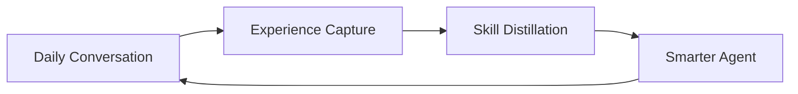

  <h1 align="center">Persona-craw</h1>
  
<em>An AI that learns from how you talk to it — every day, a little better.</em>

  
  

  
  
  
  

---

Most AI assistants are frozen. They never learn from you.

**Persona-craw** is different. It picks up on your everyday words — corrections, preferences, habits — and quietly turns them into skills. No labeling. No training buttons. You just use it, and it gets better.

> Your daily conversations are the training data.

---

## Stories

> *Full stories: [docs/storytelling.md](docs/storytelling.md)*

**Life** — You ask the assistant to plan a trip. "I prefer boutique hotels." Three weeks later, you're planning Paris — and it already picks boutique hotels without being asked. A month in, meal plans match your taste, emails sound like you, reminders fire on the right days. You stopped explaining weeks ago. Before Persona-craw, you'd re-explain preferences every single session. Now it just knows.

**Work** — First week, you correct everything: "wrong template," "use pytest," "skip the intro." By month two, reports come out right. Code scaffolds match your style. When a hard architecture problem lands, a powerful model figures it out behind the scenes — and your daily model applies that pattern next time automatically. Before, every project started from zero. Now your AI carries your entire engineering profile.

---

## Product

> *Full details: [docs/product.md](docs/product.md)*

| Capability | Benefit |
|------------|---------|
| **Skill Distillation** | Corrections become permanent skills. You never repeat yourself. |
| **RL from Daily Words** | Your everyday language trains the AI — "perfect," "no," even silence. |
| **Master-Apprentice** | Hard tasks get top-tier thinking. Daily tasks are fast and cheap. |
| **Local-Cloud Hybrid** | Personalized local model + cloud power. Growing smarter over time. |

---

## Research

> *Full details: [docs/research.md](docs/research.md)*

| Direction | Core Question |
|-----------|--------------|
| **Skill System** | How to distill daily conversation into reusable skills? Context → memory → skill pipeline. |
| **Master-Apprentice** | How can a strong model teach a small model? Explore, distill, execute. |
| **RL by Daily Words** | How to turn natural language into RL reward? Algorithms and infrastructure. |
| **Local-Cloud Hybrid** | How to combine local LoRA-RL with cloud API? Routing and knowledge transfer. |

---

## Architecture

> *Full details: [docs/architecture.md](docs/architecture.md)*

| Layer | Components |
|-------|-----------|
| **Serving** | Agent Runtime, Gateway / Proxy |
| **Data** | Experience Store, Skill Bank |
| **Learning** | Reward Pipeline, RL Training Engine |
| **Operations** | Scheduler, Evaluation |

---

## Roadmap

**Phase 1** — Skill extraction and retrieval. Agent improves through skill accumulation alone.

**Phase 2** — Daily words → RL reward pipeline. Continuous policy improvement.

**Phase 3** — Master-apprentice distillation + online RL training.

**Phase 4** — Local LoRA-RL + cloud hybrid. Autonomous self-evolution.

---

Related survey: [Awesome Agentic RL](https://github.com/DUXUCHONG/Awesome-Agentic-RL)
