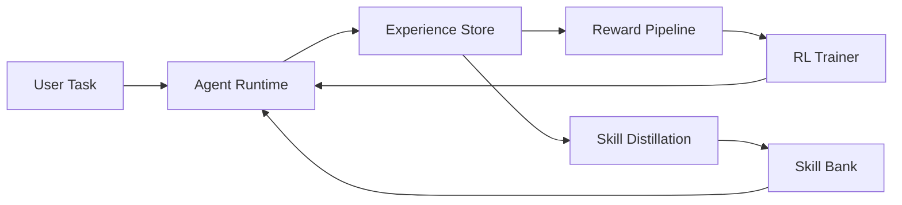
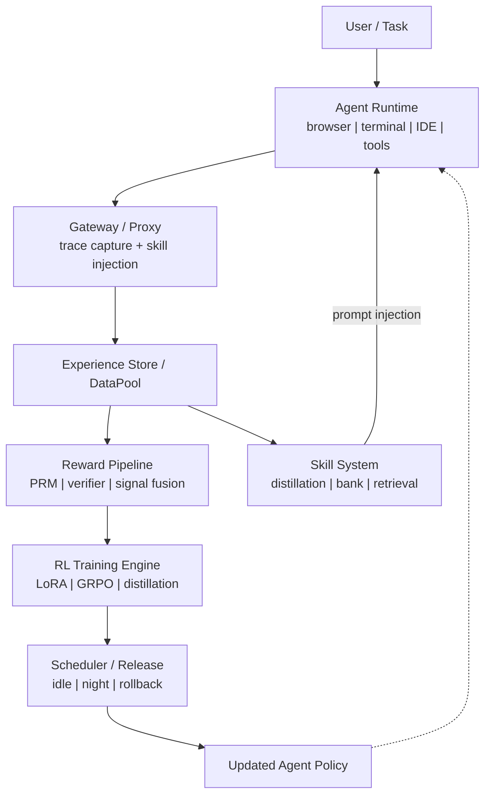

<p align="center">
  <h1 align="center">EvoAgentOS</h1>
  <p align="center"><em>A self-evolving AI Agent system that continuously improves from real-world interaction.</em></p>
</p>

<p align="center">
  <a href="LICENSE"></a>
  <a href="docs/research.md"></a>
  <a href="docs/product.md"></a>
  <a href="docs/architecture.md"></a>
</p>

---

Most AI assistants are static. They are trained once and deployed forever.

**EvoAgentOS** is different. It learns from every interaction, distills reusable skills from experience, and updates its own policy through online reinforcement learning — all while running.

> **The agent gets better every day.**

---

## Core Loop



Every interaction feeds a continuous learning loop:

1. **Execute** — The agent runs tasks using browser, terminal, IDE, and tools
2. **Record** — Every step becomes structured experience
3. **Evaluate** — Reward signals are computed from outcomes, user feedback, and behavioral patterns
4. **Distill** — Successful trajectories become reusable skills
5. **Update** — The agent policy improves through reinforcement learning
6. **Repeat** — The improved agent handles the next task

---

## System Architecture



---

## Key Components

| Module | Purpose | Key Idea |
|--------|---------|----------|
| **[Runtime](runtime/)** | Execute tasks with LLM + tools | Unified step schema across browser, terminal, IDE |
| **[Gateway](gateway/)** | Intercept requests, inject skills, capture traces | OpenAI-compatible proxy — minimal invasion |
| **[Storage](storage/)** | Store structured experience | Hot path for training, cold path for analysis |
| **[Reward](reward/)** | Convert interaction into learning signals | Fuse explicit feedback, task outcomes, implicit signals |
| **[Skills](skills/)** | Distill trajectories into reusable strategies | Hierarchical skill bank with semantic retrieval |
| **[Trainer](trainer/)** | Update agent policy via RL | Pluggable backends: Tinker, MinT, local GRPO |
| **[Scheduler](scheduler/)** | Control when and how models update | Night training, idle windows, safe rollback |
| **[Eval](eval/)** | Measure agent improvement | Online evaluation, skill quality, A/B testing |

---

## Documentation

| Document | Description |
|----------|-------------|
| **[Product](docs/product.md)** | What EvoAgentOS feels like as a product — everyday language, real scenarios |
| **[Research](docs/research.md)** | The scientific problems this project investigates — academic framing |
| **[Architecture](docs/architecture.md)** | Technical system design — subsystems, schemas, data flows, design principles |

---

## Roadmap

### Phase 1 — Skill-Based Agent

Build the minimum viable learning loop without RL training.

- Agent Runtime with trajectory recording
- Experience Store for structured data collection
- Skill distillation from successful trajectories
- Skill retrieval and prompt injection at inference time

**Milestone:** Agent improves through skill accumulation alone.

### Phase 2 — Reward Pipeline

Add the ability to convert interaction into training signals.

- PRM / judge-based evaluation
- Task completion verification
- Implicit reward extraction from behavioral patterns
- Reward signal fusion

**Milestone:** Every interaction produces a usable learning signal.

### Phase 3 — Online RL

Enable actual policy updates through reinforcement learning.

- LoRA fine-tuning from accumulated experience
- Pluggable trainer backends (Tinker, MinT, local GRPO)
- Model versioning and checkpoint management
- Rollback on regression

**Milestone:** Agent policy measurably improves through RL.

### Phase 4 — Continual Learning Agent

Build the full autonomous evolution system.

- Scheduler for idle/night/calendar-window training
- Skill evolution and recursive refinement
- Continual benchmarking dashboard
- Safe model hot-swap during operation

**Milestone:** Fully self-evolving agent system running continuously.

---

## Repository Structure

```
EvoAgentOS/
├── docs/
│   ├── product.md            # Product vision (casual language)
│   ├── research.md           # Research problems (academic)
│   └── architecture.md       # System design (technical)
├── runtime/                  # Agent execution environment
├── gateway/                  # Request proxy + skill injection
├── storage/                  # Experience store + DataPool
├── reward/                   # Reward models + signal fusion
├── skills/                   # Skill distillation + bank + retrieval
├── trainer/                  # RL training backends
├── scheduler/                # Model update orchestration
├── eval/                     # Evaluation and benchmarking
├── examples/                 # Usage examples and demos
└── scripts/                  # Operational scripts
```

---

## Inspiration

This project builds on ideas from several recent research efforts:

- **OpenClaw-RL** — Async online RL loop: serving, rollout, judging, training
- **Claw-R1** — Gateway + DataPool middleware for decoupling agent and training sides
- **SkillRL** — Trajectory-to-skill distillation and hierarchical SkillBank
- **MetaClaw** — Skill injection, auto-summarization, idle-window model updates
- **MinT** — Lightweight online training backend
- **Tinker** — Distributed RL training orchestration

For a comprehensive survey of Agentic RL research, see [Awesome Agentic RL](https://github.com/DUXUCHONG/Awesome-Agentic-RL).

---

## License

[MIT](LICENSE)
