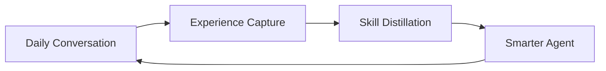

  <h1 align="center">Persona-craw</h1>
  
<em>An AI that learns from how you talk to it — every day, a little better.</em>

  
  
  

---

Most AI assistants are frozen. They never learn from you.

**Persona-craw** is different. It picks up on your everyday words — corrections, preferences, habits — and quietly turns them into skills. No labeling. No training buttons. You just use it, and it gets better.

> Your daily conversations are the training data.

---

## How It Works

You talk to Persona-craw like any other assistant.

When you say things like:

> "Good, but shorter next time."

> "No, always use pytest."

> "I like bullet points, not paragraphs."

Those everyday reactions become learning signals. The system distills them into reusable skills, and the agent gradually adapts to how **you** work.

You don't notice training. You just notice the assistant getting better.

---

## What It Does

| Capability | How It Feels |
|------------|-------------|
| **Learns your preferences** | You correct it once, it remembers forever |
| **Adapts to your style** | Reports, emails, code — all in your voice |
| **Gets faster over time** | Less back-and-forth, fewer corrections |
| **Works across tasks** | Travel, coding, writing, research — skills transfer |

---

## Scenarios

**Personal Assistant** — You plan a trip. You mention you prefer boutique hotels. Next trip, it already knows.

**Coding Assistant** — You say "keep it flat, use pytest." Every future project scaffold follows your style.

**Research Assistant** — You tell it "focus on experiments, skip the intro." All future summaries adapt.

**Daily Workflows** — Reports, emails, meeting notes. After a few weeks, corrections become rare.

---

## Documentation

| Page | What It Covers |
|------|---------------|
| **[Product](docs/product.md)** | What Persona-craw feels like to use — everyday language, real scenarios |
| **[Research](docs/research.md)** | The science behind it — self-evolving agents, RL from daily words |
| **[Architecture](docs/architecture.md)** | System design — how the pieces fit together |

---

## The Big Idea

Most AI products ship a model and call it done. Persona-craw closes the gap between **using** an AI and **teaching** it — by making them the same thing.

Your words are the curriculum. Your habits are the reward signal. Your corrections are the training data.

> The agent gets better every day.

---

## Roadmap

**Phase 1** — Skill accumulation from conversation. No model training, just skill extraction and reuse.

**Phase 2** — Reward pipeline. Turn implicit signals (corrections, retries, preferences) into structured learning signals.

**Phase 3** — Online RL. Use daily interaction to fine-tune the agent policy via reinforcement learning.

**Phase 4** — Fully autonomous self-evolution. Night training, skill refinement, continual benchmarking.

---

## Inspiration

Built on ideas from:

- **SkillRL** — Trajectory-to-skill distillation
- **OpenClaw-RL** — Async online RL for agents
- **Claw-R1** — Gateway/DataPool middleware
- **MetaClaw** — Skill injection and idle-window updates

Survey: [Awesome Agentic RL](https://github.com/DUXUCHONG/Awesome-Agentic-RL)
