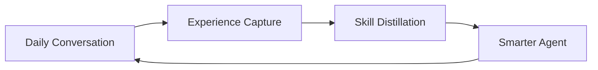

  <h1 align="center">Persona-craw</h1>
  
<em>An AI that learns from how you talk to it — every day, a little better.</em>

  
  
  

---

Most AI assistants are frozen. They never learn from you.

**Persona-craw** is different. It picks up on your everyday words — corrections, preferences, habits — and quietly turns them into skills. No labeling. No training buttons. You just use it, and it gets better.

> Your daily conversations are the training data.

---

## How It Works

You talk to Persona-craw like any other assistant.

> "Good, but shorter next time."

> "No, always use pytest."

> "I like bullet points, not paragraphs."

Those everyday reactions become learning signals. The system distills them into reusable skills, and the agent gradually adapts to how **you** work.

You don't notice training. You just notice the assistant getting better.

---

## What It Does

| Capability | How It Feels |
|------------|-------------|
| **Learns skills from your habits** | You correct it once, it remembers forever — and builds compound skills over time |
| **Remembers what matters** | Months of history compressed into useful knowledge, not wasted context |
| **Expert prepares, junior runs** | Tough tasks get top-tier thinking; daily tasks run fast and cheap |
| **Your corrections train the AI** | "No, not like that" isn't just a correction — it's actual training |
| **Personal locally, powerful when needed** | Fast local model for daily use, cloud model for hard problems — and knowledge flows back |

---

## Scenarios

**Personal Assistant** — You plan a trip. You mention boutique hotels. Next trip, it already knows your style. Complex multi-city logistics? A powerful model handles it behind the scenes, serves you the result in your preferred format.

**Coding Assistant** — You say "keep it flat, use pytest." Every future scaffold follows your style. Tricky architecture problems get explored by a senior model and distilled into patterns your daily model applies automatically.

**Research Assistant** — You tell it "focus on experiments, skip the intro." All future summaries adapt. Dense papers get heavy-model processing; results arrive in your preferred format, fast and cheap.

**Daily Workflows** — Reports, emails, meeting notes. After a few weeks, corrections become rare. Most runs locally and instantly; complex analysis reaches the cloud when needed.

---

## Documentation

| Page | What It Covers |
|------|---------------|
| **[Product](docs/product.md)** | What Persona-craw feels like to use — everyday language, real scenarios |
| **[Research](docs/research.md)** | The science behind it — skills, memory, master-apprentice, RL from daily words, local-cloud hybrid |
| **[Architecture](docs/architecture.md)** | System design — how the pieces fit together |

---

## The Big Idea

Most AI products ship a model and call it done. Persona-craw closes the gap between **using** an AI and **teaching** it — by making them the same thing.

Your words are the curriculum. Your habits are the reward signal. Your corrections are the training data.

> The agent gets better every day.

---

## Roadmap

**Phase 1 — Skill Foundation.** Extract skills from daily conversation. Build a hierarchical skill bank. Compress context into reusable knowledge. Agent improves through skill accumulation alone.

**Phase 2 — Daily Words Reward.** Turn everyday language into RL reward signals. Build the implicit reward pipeline. Map corrections, preferences, and behavior into training data.

**Phase 3 — Master-Apprentice + Online RL.** Strong model explores hard tasks, distills knowledge for the daily model. Online RL training from daily word rewards. Skill evolution through the RL feedback loop.

**Phase 4 — Local-Cloud Hybrid + Autonomous Evolution.** Local LoRA-RL personalization. Smart routing between local and cloud models. Continuous self-evolution with safe updates and regression detection.

---

Related survey: [Awesome Agentic RL](https://github.com/DUXUCHONG/Awesome-Agentic-RL)
