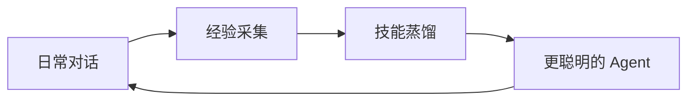

  <h1 align="center">Persona-craw</h1>
  
<em>一个从你的日常对话中学习的 AI —— 每天都在变得更好。</em>

  
  

  
  
  
  

---

大多数 AI 助手是静态的。它们从来不会从你身上学到任何东西。

**Persona-craw** 不一样。它会从你的日常用语中捕捉信号 —— 纠正、偏好、习惯 —— 然后悄悄地把这些变成技能。不需要标注数据，不需要训练按钮。你只管用，它自己会变好。

> 你的日常对话就是训练数据。

---

## 故事

> *完整故事：[docs/storytelling_cn.md](docs/storytelling_cn.md)*

**生活** —— 你让助手规划旅行，随口说了句"我喜欢精品酒店"。三周后你规划巴黎行程，它自动选了精品酒店，你没提。一个月后，餐饮计划符合你的口味，邮件是你的语气，提醒准时到达。你几周前就不再解释了。以前，每次对话你都得重新说一遍偏好。现在它就是知道。

**工作** —— 第一周你什么都在纠正："模板不对""用 pytest""跳过开头段落"。到第二个月，报告自动正确，代码架构符合你的风格。遇到棘手的架构问题，一个强大模型在幕后探索方案 —— 你的日常模型下次自动套用这个模式。以前每个项目从零开始。现在你的 AI 承载了你的整个工程档案。

---

## 产品

> *详情：[docs/product_cn.md](docs/product_cn.md)*

| 能力 | 好处 |
|------|------|
| **技能蒸馏** | 纠正一次就变成永久技能，再也不用重复自己 |
| **日常用语训练** | "很好""不对""算了" —— 你的日常语言就是训练信号 |
| **师徒模式** | 困难任务用强模型，日常任务又快又便宜 |
| **本地+云端混合** | 个性化本地模型 + 云端算力，越用越聪明 |

---

## 研究

> *详情：[docs/research_cn.md](docs/research_cn.md)*

| 方向 | 核心问题 |
|------|---------|
| **技能系统** | 如何将日常对话蒸馏成可复用技能？Context → Memory → Skill 管线 |
| **师徒学习** | 强模型如何教会小模型？探索、蒸馏、执行 |
| **日常语言 RL** | 如何将自然语言转化为 RL 奖励？算法与基础设施 |
| **本地+云端混合** | 如何结合本地 LoRA-RL 与云端 API？路由与知识回传 |

---

## 架构

> *详情：[docs/architecture.md](docs/architecture.md)*

| 层 | 组件 |
|----|------|
| **服务层** | Agent Runtime、Gateway / Proxy |
| **数据层** | Experience Store、Skill Bank |
| **学习层** | Reward Pipeline、RL Training Engine |
| **运维层** | Scheduler、Evaluation |

---

## 路线图

**阶段 1** —— 技能提取与检索。Agent 仅通过技能积累来提升。

**阶段 2** —— 日常用语 → RL 奖励管线。持续策略改进。

**阶段 3** —— 师徒蒸馏 + 在线 RL 训练。

**阶段 4** —— 本地 LoRA-RL + 云端混合。自主持续进化。

---

相关综述：[Awesome Agentic RL](https://github.com/DUXUCHONG/Awesome-Agentic-RL)
