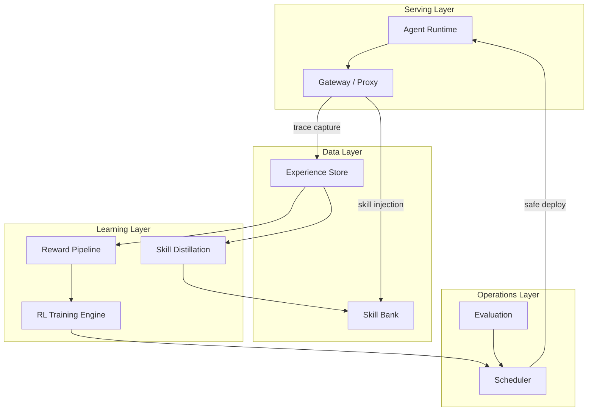

# Persona-craw — Architecture

---

## System Overview

Persona-craw is organized into four layers. The serving side handles user interaction. The data layer stores experience and skills. The learning side converts experience into policy improvements. The operations layer ensures safe, continuous updates.

---

## Serving Layer

**Agent Runtime** — Executes user tasks using LLM and tools (browser, terminal, IDE, APIs). Records every step as a structured trajectory.

**Gateway / Proxy** — The single entry point. Intercepts model requests, injects retrieved skills into the prompt, captures interaction traces, and forwards requests to the model server. OpenAI-compatible — external agents only need to change `base_url`.

---

## Data Layer

**Experience Store** — Central repository for all interaction data. Supports two tiers: a hot tier for recent interactions (fed to reward pipeline and trainer) and a cold tier for long-term storage (fed to skill distillation and evaluation).

**Skill Bank** — Hierarchical store of distilled skills. Each skill has trigger conditions, strategy steps, anti-patterns, quality scores, and an embedding for semantic retrieval. Organized by level: general, domain, task-specific.

---

## Learning Layer

**Reward Pipeline** — Converts raw experience into training signals. Three sources: heuristic reward (rule-based), learned reward (LLM-as-judge / PRM), and delayed outcome reward (task verification). Signals are fused into step-level and episode-level rewards.

**Skill Distillation** — Transforms the context → memory → skill pipeline. Detects patterns across interaction history, consolidates structured memory, and distills compact skills. Handles skill evolution, merging, deprecation, and promotion across hierarchy levels.

**RL Training Engine** — Updates agent policy from rewards and experience. Pluggable backend architecture supporting multiple training modes: skills-only, LoRA fine-tuning, online GRPO, distillation, offline SFT. Backends include Tinker, MinT, and local GRPO.

---

## Operations Layer

**Scheduler** — Controls when and how model updates are deployed. Strategies include night training, idle-time training, calendar-window training, and manual approval. Safety mechanisms: regression testing before deploy, canary rollout, automatic rollback.

**Evaluation** — Measures agent improvement over time. Online evaluation from live interaction, offline benchmarking, skill quality assessment, and A/B testing between model versions.
