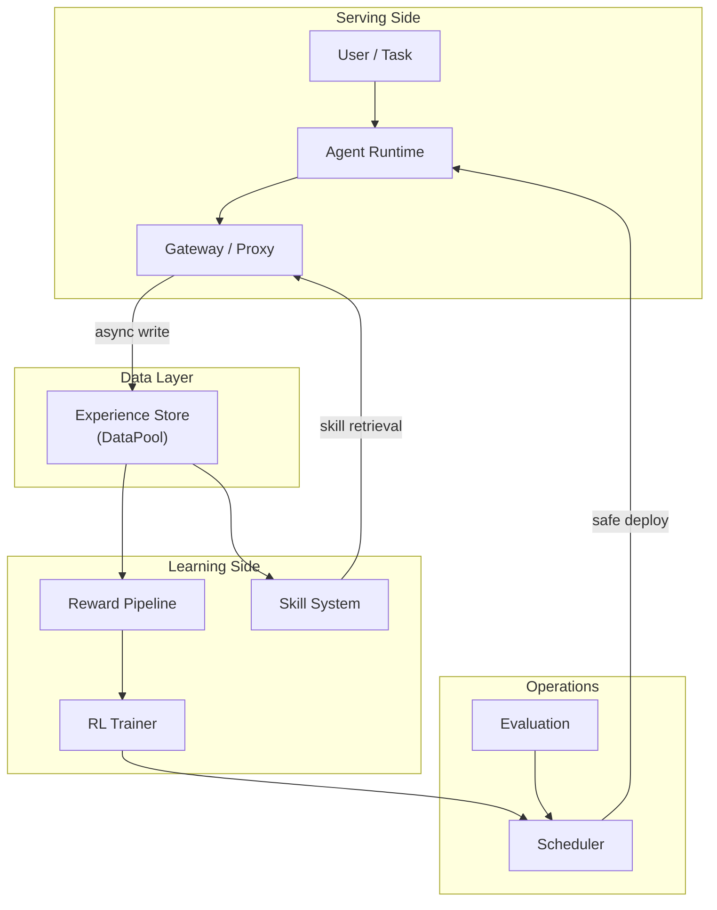
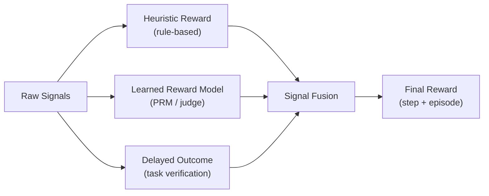
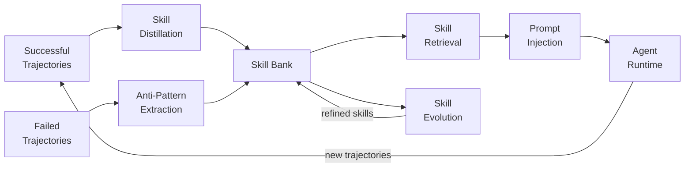
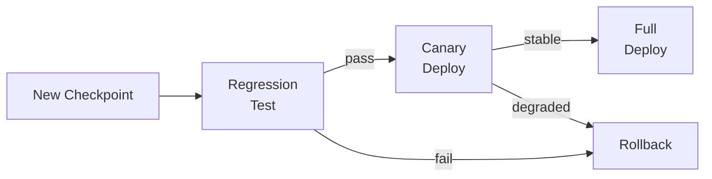
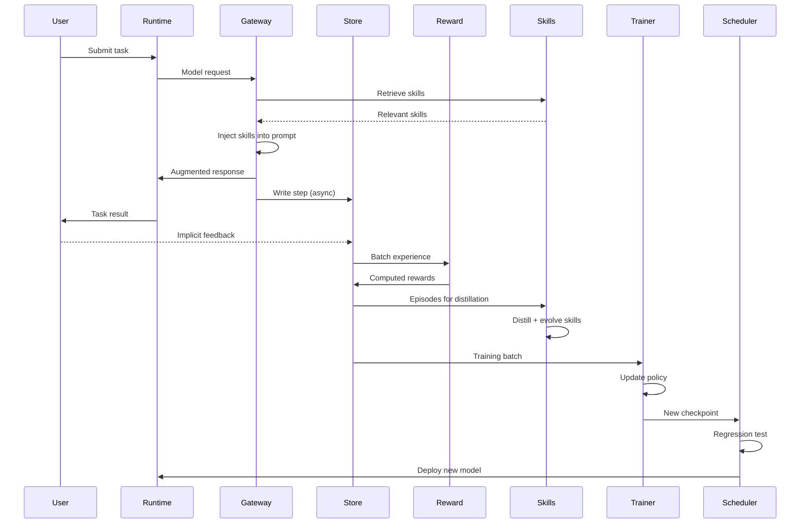

# EvoAgentOS — Architecture

This document describes the technical architecture of EvoAgentOS. The system is designed as modular infrastructure for building self-improving AI agents that learn continuously from real-world interaction.

---

## 1. System Overview

The system consists of six major subsystems connected by asynchronous data flows:

1. **Agent Runtime** — Executes tasks using LLM + tools
2. **Gateway / Proxy** — Intercepts requests, injects skills, captures traces
3. **Experience Store** — Stores structured interaction data
4. **Reward Pipeline** — Converts experience into training signals
5. **Skill System** — Distills trajectories into reusable strategies
6. **RL Training Engine** — Updates agent policy

Two supporting subsystems handle operational concerns:

7. **Scheduler** — Controls model update timing and safety
8. **Eval** — Measures agent improvement over time



The critical design principle is **separation of serving and learning**. The serving side (Runtime + Gateway) never blocks on training. The learning side (Reward + Skills + Trainer) consumes experience asynchronously. The Scheduler mediates model updates between the two sides.

---

## 2. Agent Runtime

The runtime is the system's execution layer. It receives user tasks, plans action sequences, executes them using tools, and produces step-level trajectories.

### Supported Environments

| Environment | Description |
|-------------|-------------|
| **Browser** | Web page navigation, form filling, content extraction |
| **Terminal** | Shell command execution, file system operations |
| **IDE** | Code editing, project navigation, debugging |
| **API Tools** | External service calls, database queries, search |

### Step Schema

Every action the agent takes is recorded as a structured step:

```yaml
Step:
  step_id: string
  episode_id: string
  timestamp: datetime
  state:
    task_description: string
    context_window: string
    active_environment: string
  action:
    type: enum [tool_call, text_generation, environment_action]
    content: string
    tool_name: string | null
    tool_args: dict | null
  observation:
    type: enum [tool_result, environment_state, user_response]
    content: string
    success: boolean
  metadata:
    latency_ms: int
    token_count: int
    model_version: string
```

### Key Interfaces

```python
class AgentRuntime:
    def run_task(task: Task) -> Episode
    def step(action: Action) -> Observation
    def emit_trace(step: StepRecord) -> None
    def inject_skills(skills: list[Skill]) -> None
```

The runtime is **stateless with respect to learning** — it does not maintain training state. All learning happens downstream via the Experience Store.

---

## 3. Gateway / Proxy

The gateway is the system's single entry point. It sits between the agent runtime and the underlying model server, intercepting every request.

### Responsibilities

1. **Request interception** — Capture all model calls with full context
2. **Trace generation** — Assign episode and step IDs, build trajectory structure
3. **Skill injection** — Retrieve relevant skills and prepend them to the system prompt
4. **Async submission** — Write step records to the Experience Store without blocking the serving path
5. **Request forwarding** — Proxy the (possibly augmented) request to the model server

### Design: OpenAI-Compatible Proxy

The gateway exposes an OpenAI-compatible API. External agents only need to change `base_url` to route through EvoAgentOS. This minimizes integration cost and makes the system compatible with any OpenAI-client-based agent framework.

```
Agent (any framework)
    |
    | POST /v1/chat/completions
    v
Gateway (EvoAgentOS)
    |
    | 1. Log request
    | 2. Retrieve skills
    | 3. Inject skill context
    | 4. Forward to model
    | 5. Log response
    | 6. Write step to Store
    v
Model Server
```

---

## 4. Experience Store

The Experience Store is the central data layer. All interaction data flows through it, serving both the reward pipeline and the skill system.

### Experience Schema

```yaml
Experience:
  episode_id: string
  task:
    description: string
    domain: string
    complexity: enum [simple, moderate, complex]
  context:
    user_id: string
    session_id: string
    environment: string
  steps: list[Step]
  outcome:
    success: boolean
    completion_ratio: float
    error_type: string | null
  feedback:
    explicit:
      rating: int | null
      comment: string | null
    implicit:
      user_accepted: boolean
      retry_count: int
      session_continued: boolean
      time_to_next_action_ms: int
  reward:
    step_rewards: list[float]
    episode_reward: float
    reward_source: enum [heuristic, learned, delayed]
  tags: list[string]
  created_at: datetime
```

### Two-Tier Storage

| Tier | Purpose | Retention | Consumers |
|------|---------|-----------|-----------|
| **Hot** | Recent interactions for online training | Hours to days | RL Trainer, Reward Pipeline |
| **Cold** | Full history for analysis and distillation | Indefinite | Skill System, Evaluation, Research |

The hot tier acts as a **DataPool** (following the Claw-R1 pattern): the Gateway writes asynchronously, and the Trainer pulls batches at its own pace. This decouples write throughput from training speed.

---

## 5. Reward Pipeline

The reward pipeline converts raw experience into training signals. It operates asynchronously — experience arrives from the Store, and computed rewards are written back.

### Reward Sources

| Source | Signal Type | Latency |
|--------|------------|---------|
| **User feedback** | Explicit rating, correction, preference | Immediate |
| **Task outcome** | Success/failure, completion ratio | End of episode |
| **Tool result** | Exit code, API response validity | Per step |
| **Behavioral signal** | Retry rate, acceptance, session continuity | Delayed |

### Reward Computation Layers



**Layer 1: Heuristic Reward.** Rule-based signals derived directly from interaction data. Examples: tool call success (+1), user correction (-0.5), task completion (+2).

**Layer 2: Learned Reward Model.** A trained model (PRM or LLM-as-judge) that scores trajectory quality. This captures nuanced quality signals that rules cannot express.

**Layer 3: Delayed Outcome Reward.** Verification-based reward computed after the episode ends. Examples: running tests on generated code, checking that a planned itinerary is valid.

**Signal Fusion** combines all layers into a final reward vector, with configurable weights per source.

---

## 6. Skill System

The skill system is the primary mechanism for long-term knowledge retention. It converts raw trajectories into structured, reusable strategies.

### Skill Schema

```yaml
Skill:
  skill_id: string
  title: string
  description: string
  trigger_conditions:
    task_patterns: list[string]
    domain: string | null
    keywords: list[string]
  strategy:
    steps: list[string]
    rationale: string
  anti_patterns:
    - description: string
      evidence_episode: string
  level: enum [general, domain, task_specific]
  quality:
    score: float
    usage_count: int
    success_rate: float
  embedding: vector
  source_episodes: list[string]
  version: int
  created_at: datetime
  updated_at: datetime
```

### Hierarchical Skill Bank

Skills are organized into three levels:

| Level | Scope | Example |
|-------|-------|---------|
| **General** | Cross-domain principles | "Verify preconditions before irreversible actions" |
| **Domain** | Within a specific domain | "Check rate limits before bulk API calls" |
| **Task-Specific** | Narrow, high-precision procedures | "When generating a GitHub README, include badges, architecture diagram, and roadmap" |

### Skill Lifecycle



**Distillation:** Extract common patterns from clusters of successful trajectories. The distiller identifies invariant action sequences, abstracts away task-specific details, and generates a structured skill record.

**Retrieval:** At inference time, the current task is embedded and matched against the skill bank using semantic similarity. Top candidates are re-ranked for relevance, and the selected skills are injected into the agent's system prompt.

**Evolution:** Periodically, the skill bank undergoes refinement. Skills with low success rates are deprecated. Similar skills are merged. High-performing skills are promoted to higher abstraction levels.

---

## 7. RL Training Engine

The training engine updates the agent policy using experience from the Store and rewards from the Pipeline.

### Pluggable Backend Architecture

The trainer is designed as a pluggable system. The core interface is:

```python
class TrainerBackend(ABC):
    @abstractmethod
    def submit_batch(self, batch: TrainingBatch) -> JobID: ...

    @abstractmethod
    def get_status(self, job_id: JobID) -> TrainingStatus: ...

    @abstractmethod
    def fetch_checkpoint(self, job_id: JobID) -> ModelCheckpoint: ...

    @abstractmethod
    def rollback(self, version: str) -> None: ...
```

### Supported Training Modes

| Mode | Description | When to Use |
|------|-------------|-------------|
| **Skills-Only** | No model update; only skill bank changes | Phase 1, lowest risk |
| **LoRA Fine-tuning** | Update adapter weights from experience | Phase 3, moderate risk |
| **Online GRPO** | Group relative policy optimization | Phase 3, for reasoning tasks |
| **Distillation** | Teacher-student with online data | Phase 4, for model compression |
| **Offline SFT** | Supervised fine-tuning on curated episodes | Any phase, for bootstrapping |

### Backend Implementations

| Backend | Infrastructure | Use Case |
|---------|---------------|----------|
| `TinkerBackend` | Distributed GPU cluster | Large-scale training |
| `MinTBackend` | Lightweight single-node | Fast iteration, small models |
| `LocalGRPOBackend` | Local GPU | Development and experiments |
| `SFTBackend` | Any | Supervised fine-tuning baseline |

---

## 8. Scheduler

The scheduler controls **when** and **how** model updates are deployed. This is critical for production safety.

### Update Strategies

| Strategy | Trigger | Risk Level |
|----------|---------|------------|
| **Night training** | Scheduled time window (e.g., 2-6 AM) | Low |
| **Idle training** | Detected user inactivity | Low |
| **Batch threshold** | Experience count exceeds threshold | Medium |
| **Calendar window** | User-defined training slots | Low |
| **Manual approval** | Human reviews before deploy | Lowest |

### Safety Mechanisms

- **Regression testing:** Run evaluation suite before deploying new checkpoint
- **Canary deployment:** Route a fraction of traffic to new model, monitor metrics
- **Automatic rollback:** Revert to previous checkpoint if performance drops below threshold
- **Version registry:** All checkpoints are versioned and stored for audit



---

## 9. Data Flow Summary

The complete data flow through the system:



---

## 10. Design Principles

### Asynchronous by Default

Training never blocks serving. Experience collection, reward computation, skill distillation, and policy updates all happen asynchronously. The only synchronous path is: user request -> gateway -> model -> response.

### Experience First

Real interaction is the primary source of learning. The system is designed around the assumption that the most valuable training signal comes from actual usage, not synthetic data.

### Skill Over Memory

Long-term knowledge is stored as skills (compressed, structured, reusable) rather than raw trajectories (verbose, unstructured, hard to retrieve). Skills are the system's primary knowledge representation.

### Safe Updates

Model updates are never applied immediately. Every checkpoint goes through regression testing, canary deployment, and monitoring before full rollout. Rollback is always available.

### Pluggable Backends

No component is permanently bound to a specific implementation. Training backends, reward models, skill retrievers, and environment adapters are all swappable through well-defined interfaces.

### Minimal Invasion

The gateway's OpenAI-compatible API means existing agent frameworks require only a `base_url` change to integrate. No code modifications to the agent itself.
